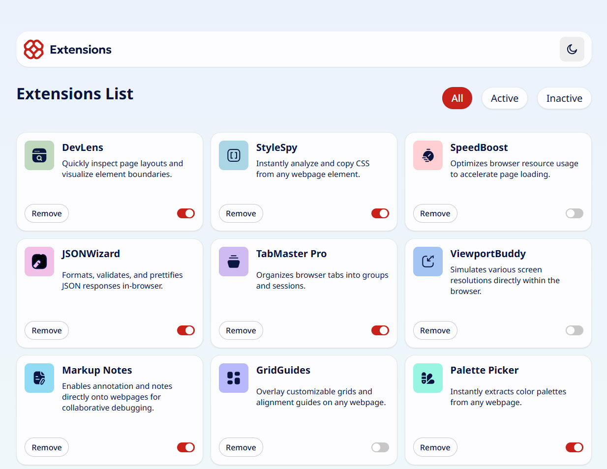

# Frontend Mentor - Browser extensions manager UI solution

This is a solution to the [Browser extensions manager UI challenge on Frontend Mentor](https://www.frontendmentor.io/challenges/browser-extension-manager-ui-yNZnOfsMAp).

## Table of contents

- [Overview](#overview)
  - [The challenge](#the-challenge)
  - [Screenshot](#screenshot)
  - [Links](#links)
- [My process](#my-process)
  - [Built with](#built-with)
  - [What I learned](#what-i-learned)

## Overview

### The challenge

Users should be able to:

- Toggle extensions between active and inactive states
- Filter active and inactive extensions
- Remove extensions from the list
- Select their color theme
- View the optimal layout for the interface depending on their device's screen size
- See hover and focus states for all interactive elements on the page

### Screenshot

### Links

- Solution URL: [Add solution URL here](https://your-solution-url.com)
- Live Site URL: [Add live site URL here](https://your-live-site-url.com)

## My process

### Built with

- Semantic HTML5 markup — Used for the core structure, including <section>, <article>, and <header> elements to improve accessibility.
- CSS Custom Properties (Variables) — Implemented a robust "two-tier" variable system for theming and scalable styling.
- Flexbox & CSS Grid — Leveraged Grid for the main extension card layout and Flexbox for component alignment within buttons and headers.
- Mobile-first workflow — Designed with responsiveness as a priority using relative units and flexible layouts.
- Vanilla JavaScript (ES6+) — Used for DOM manipulation, template literal rendering, and state management.
- Asynchronous Programming — Implemented fetch() with async/await to retrieve extension data from a local JSON source.
- SVG Sprite System — Utilized <symbol> and <use> for efficient icon management and theme-consistent coloring.

### What I learned

This project provided deep insight into building a professional-grade UI with high maintainability. Key takeaways include:

- Scalable Theming System: I implemented a centralized theme switching system using CSS custom properties in a two-tier architecture. By defining functional variables (e.g., --surface-page) that reference primitive color values (e.g., --clr-neutral-900), I can toggle a single .dark class on the body to swap the entire UI color palette without rewriting complex CSS rules.

- State Persistence with TTL: To enhance the native localStorage API, I built a custom StorageWrapper class. This utility supports namespacing and includes a "Time-To-Live" (TTL) feature. This allows the application to cache user states (theme preference, filtered views, and deleted extensions) for a specific duration (e.g., 30 minutes) before reverting to the original JSON data source.

- Dynamic UI Rendering: I practiced decoupling data from the view by using JavaScript template literals to dynamically generate extension cards. This approach made it easier to implement filtering logic (All, Active, Inactive) by simply re-filtering the data array and re-rendering the list.

